DAFTAR ISI
==========
- [LAPORAN PRAKTIKUM 7](#laporan-praktikum-7)  
    - [CODE PROGRAM DAFTAR NILAI](#code-program-daftar-nilai)
    - [FLOWCHART DAFTAR NILAI](#flowchart-daftar-nilai)
    - [KESIMPULAN](#kesimpulan)

# LAPORAN PRAKTIKUM 7

## CODE PROGRAM DAFTAR NILAI

### Step 1 : Class DaftarNilaiMahasiswa dan Method Init
Kelas yang diberikan adalah struktur utama untuk mengelola data mahasiswa. Semua operasi seperti menambah, menampilkan, menghapus, dan mengubah data dilakukan melalui metode-metode yang ada dalam kelas ini.

Selain itu, Method _init_ adalah konstruktor yang dijalankan saat objek kelas dibuat. Di sini, atribut data_mahasiswa diinisialisasi sebagai list kosong untuk menyimpan data mahasiswa.

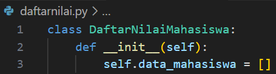

### Step 2 : Method tambah
Metode ini digunakan untuk menambahkan data mahasiswa baru ke dalam list data_mahasiswa. Data disimpan sebagai dictionary dengan kunci seperti nama, nim, L/P?, dan nilai :

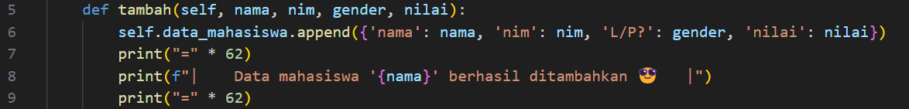

### Step 3 : Method tampilkan
Method atau Fungsi ini mencetak daftar mahasiswa yang sudah tersimpan. Jika daftar kosong, akan menampilkan pesan "Tidak ada data mahasiswa". Jika tidak kosong, data ditampilkan dalam bentuk tabel dengan nomor urut, nama, NIM, gender, dan nilai :

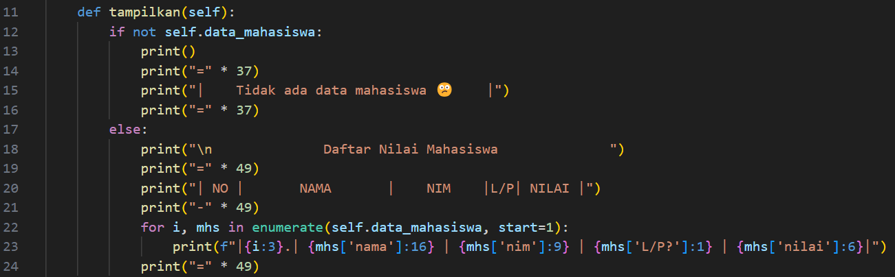

### Step 4 : Method hapus
Selanjutnya ada method menghapus data mahasiswa dengan cara kerja program mencari sebuah nama yang telah diinputkan, jika nama ditemukan maka program akan langsung menghapus nama tersebut dari daftar, namun jika tidak ditemukan program akan memberi tahu kalau tidak ada daftar yang ditemukan : 

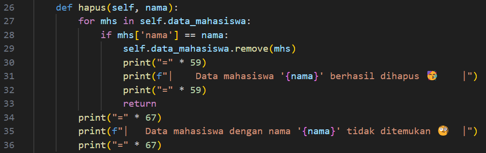

### Step 5 : Method ubah
Method ini sama seperti sebelumnya jika di lihat dari cara kerjanya namun di fungsi kali ini program akan mengubah suatu nama dari daftar, Jika nama ditemukan, data seperti NIM, gender, dan nilai akan diperbarui. Jika tidak, akan menampilkan pesan bahwa data tidak ditemukan :
 
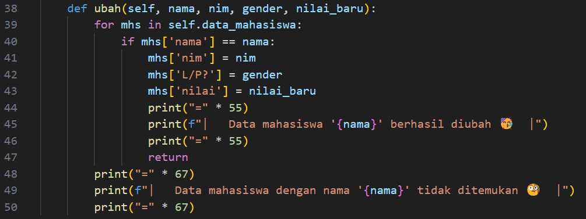

### Step 6 : Fungsi _main_ dan Menu interaktif
Bagian ini adalah titik awal program. Program berjalan dalam loop yang menawarkan menu interaktif kepada pengguna untuk memilih salah satu opsi, Setiap pilihan menjalankan metode yang sesuai dari kelas DaftarNilaiMahasiswa. Jika pilihan tidak valid, program akan meminta pengguna mencoba lagi :

1. Tambah data (opsi 1)
2. Tampilkan data (opsi 2)
3. Hapus data (opsi 3)
4. Ubah data (opsi 4)
5. Keluar dari program (opsi 5)

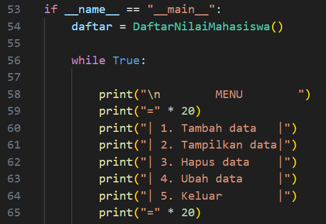

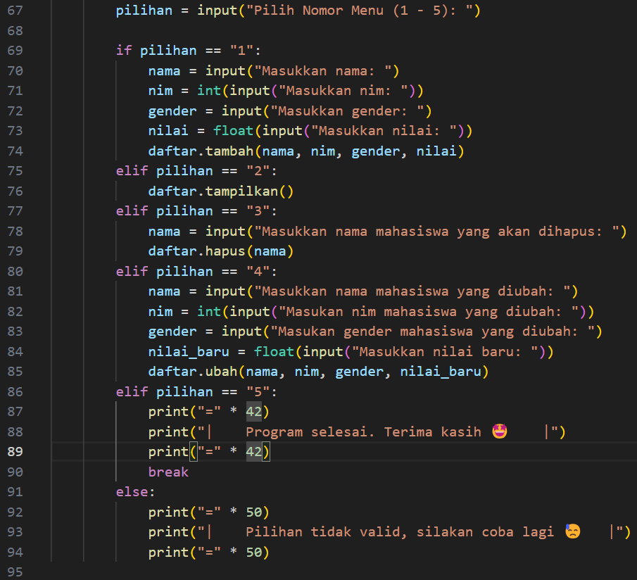

### Step 7 : Run Program
Tahap akhir adalah uji coba code program yang sudah dibuat dengan mencoba berbagai kemungkinan yang ada.

#### Case 1 :
Kondisi pertama kita akan coba melihat tabel dengan inputkan 2 tampa menambahkan data/masih kosong, maka akan ditampilkan isi tabel masih belum ada datanya, akan ditampilkan 'Tidak ada Data Mahasiswa' :

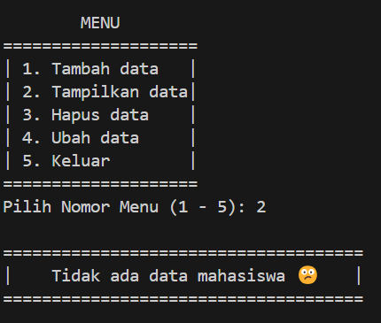

#### Case 2 :
Kondisi kedua selanjutnya mencoba menambahkan data mahasiswa pada tabel, dengan menginputkan 1 untuk menambahkan data mahasiswa. Untuk awalan, coba memasukan satu data mahasiswa :

- Nama : Dafa Maulana
- Nim : 312410387
- Gender : L
- Nilai : 90

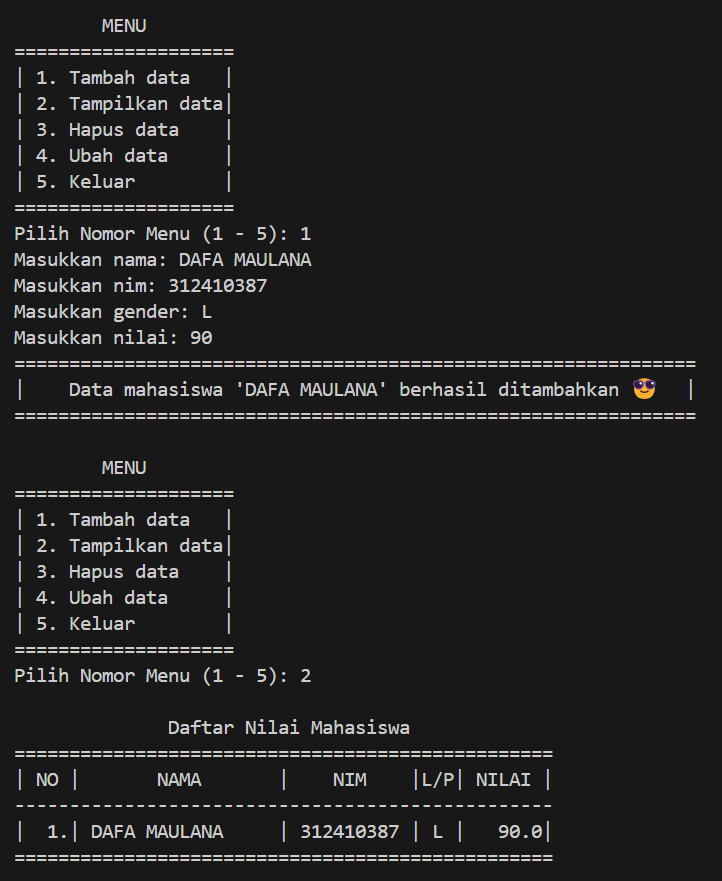

#### Case 3 :
Selanjutnya, kondisi ketiga masukan/tambah lagi daftar mahasiswa sebanyak 3 data untuk memperbanyak data yang ditampilkan, setelah itu pilih 2 kembali untuk melihat data yyang sudah ditambahkan, berikut data yang harus di tambahkan :

1. Data pertama :
    - Nama : Raihan Ardiansyah
    - Nim : 312410396
    - Gender : L
    - Nilai : 92

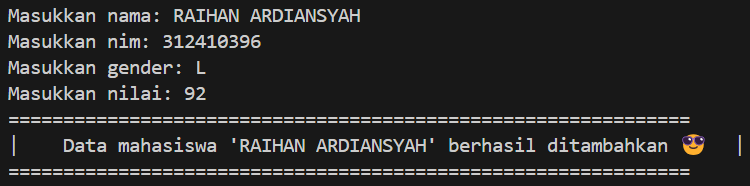

2. Data kedua :
    - Nama : M. Nikmal Wahid
    - Nim : 312410372
    - Gender : L
    -Nilai : 95

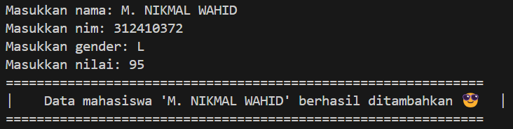

3. Data ketiga :
    - Nama : Yarni Gea
    - Nim : 312410413
    - Gender : P
    - Nilai : 98

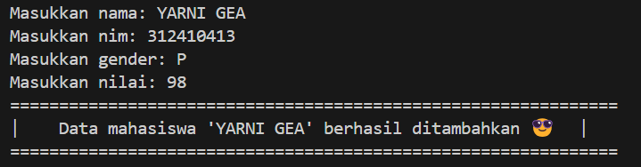

Jika sudah maka tampilan pada tabel akan seperti berikut :

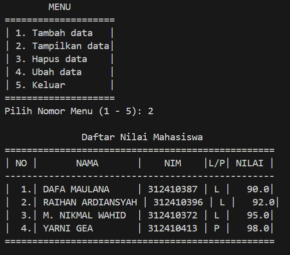

#### Case 4 :
Masuk kondisi keempat kita akan coba mengubah data, ada data yang salah diinputkan pada Nilai Mahasiswa 92 diubah menjadi 93, sebelum itu inputkan 4 untuk mengubah lalu user diminta untuk memasukan nama mahasiswa, nim, gender, dan Nilai beru, kita coba memasukan data berikut :

1. Data yang diubah :
    - Nama : Raihan Ardiansyah
    - Nim : 312410396
    - Gender : L
    - Nilai : 93

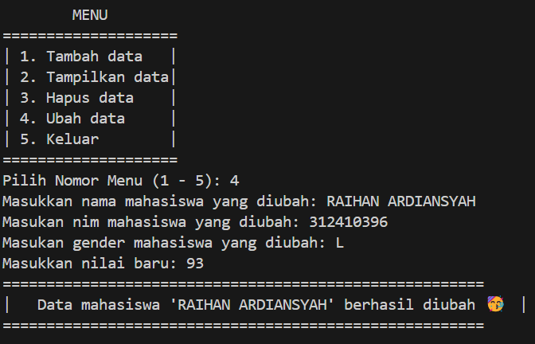

Maka Tampilan nya akan seperti berikut ini :

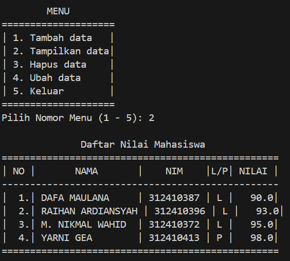

#### Case 5 : 
Kondisi keenam, kita mencoba menghapus sebuah data mahasiswa dengan menginputkan 3 untuk menghapuskan data mahasiswa lalu user diminta memasukan nama mahasiswa yang akan dihapus :

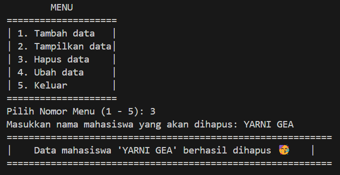

Maka data telah dihapus dari tabel data :

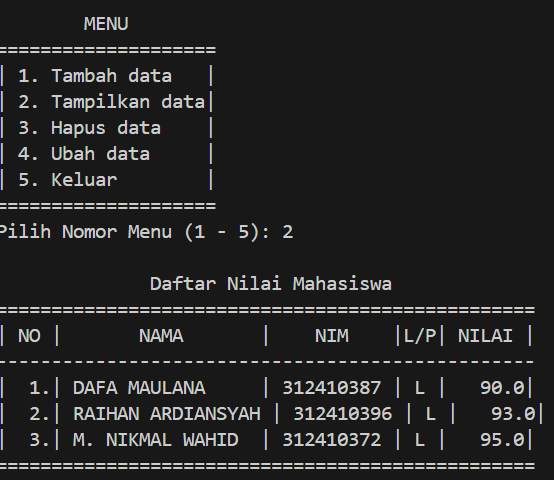

#### Case 6 :
Jika semua data atau program input sudah selesai semua, user dapat menginputkan 5 untuk keluar dari progam :

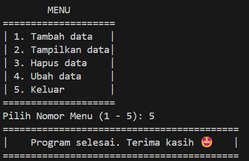

## FLOWCHART DAFTAR NILAI

![gambar]

### Step 1 :
Titik mulai sebuah program atau alur.

### Step 2 :
lalu lakukan inisialisasi dengan menampilkan menu yang tersedia.

### Step 3 :
Inputkan code menu yang ingin dilakukan, setiap code berisi :
1. Tambah, 
2. Tampilkan, 
3. Hapus, 
4. Ubah, 
5. Keluar.

### Step 4 :
Dalam kasus ini semua kemgkinan dapat terjadi, kondisi yang diperlukan sesuai apa yang akan diinoutkan user.

- Jika Tampilkan, maka user akan di tampilkan sebuah tabel dari daftar nilai, namun jika tabel belum ada isi/kosong maka akan tampil Belum ada data, jika ada maka ditampilkan sebuah data nilai mahasiswa. Setelah tampilkan data maka akan kembali menuju inisialisasi menu. 

- Jika Tambah, user diminta memasukan sebuah data yang berupa :
    - Nama
    - Nilai

Lalu User akan diarahkan kembali ke inisialiasi menu.

- Jika Ubah, sama dengan Tampilkan jika tidak ada data nilai maka akan tampil tidak ada data nilai namun Ubah kalau ada data nilai user diminta menginputkan Nama Mahasiswa yang akan diubah, setelah itu diminta untuk mengisi atau menginputkan data valid yang diubah. Setelah itu user kembali ke inisialisasi menu.

- Jika Hapus, user akan ditampilkan daftar nilai lalu diminta memasukan sebuah Nama yang ingin dihapus dari daftar. Setelah itu kembali ke inisialisasi menu.

- jika Keluar, User akan keluar program dan program akan berhenti.

## KESIMPULAN
Dengan membuat code program daftar nilai ini saya pribadi dapat mengambil pelajaran, fungsi dapat memanggil sebuah data yang telah diberikan, dengan sub rutin ini kita menjadi dipermudah dengan baik. Melalui code program daftar nilai ini saya mampu memasukan sebuah data nama mahasiswa dan nilai. Adapun flowchart yang membantu saya dalam memahami alur sebuah code program yang telah saya buat.